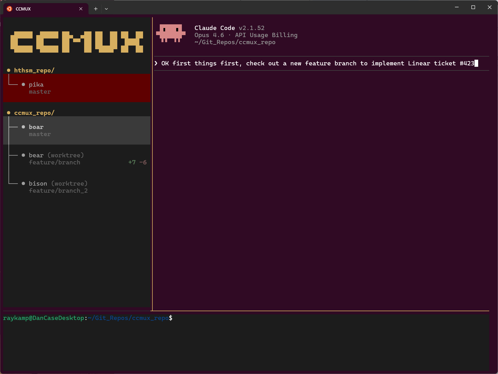

# ccmux

<p align="center">
  
</p>

A streamlined terminal-UI for juggling concurrent Claude Code sessions.

## Features

- **Visual sidebar** — see all sessions at a glance; red highlights tell you instantly when Claude needs your attention
- **CLI session management** — create, list, activate, remove sessions from the terminal
- **Git worktree isolation** — spin up duplicate sessions on isolated branches; use  `ccmux.toml` files to add additional steps when spinning up worktrees, such as setting up untracked build dependencies 

## Installation

```bash
pip install ccmux
```

## Quick Start

```bash
ccmux             # auto-creates a session for the current directory or attaches to an existing one
ccmux new         # create a new session from the current directory's repo
```

## Commands

| Command | Description |
|---------|-------------|
| *(default)* | Auto-attach to existing session or create one |
| `new [NAME]` | Create a new session (add `-w` for worktree) |
| `list` | List all sessions with status and branch info |
| `attach` | Attach to the ccmux tmux session |
| `activate [NAME]` | Reopen Claude Code in a session's tmux window |
| `deactivate [NAME]` | Close tmux window (keeps session) |
| `remove [NAME]` | Permanently delete a session |
| `rename OLD NEW` | Rename a session |
| `kill` | Kill entire ccmux session |
| `which` | Print current session name (useful for scripting) |
| `detach` | Detach from tmux |
| `export-tmux-config` | Export tmux config to a file |

## Worktree Configuration

Drop a `ccmux.toml` in your repo root to run commands after worktree creation:

```toml
[worktree]
post_create = [
    "ln -s $CCMUX_REPO_ROOT/node_modules $CCMUX_INSTANCE_PATH/node_modules",
    "cp $CCMUX_REPO_ROOT/.env $CCMUX_INSTANCE_PATH/.env",
]
```

Commands run inside the new worktree with these environment variables:

| Variable | Description |
|----------|-------------|
| `CCMUX_REPO_ROOT` | Absolute path to the main repository |
| `CCMUX_INSTANCE_PATH` | Absolute path to the new worktree |
| `CCMUX_INSTANCE_NAME` | Name of the new instance |
| `CCMUX_SESSION` | ccmux tmux session name |

## Contributing

```bash
git clone git@github.com:TheHumbleTransistor/ccmux.git
cd ccmux
pip install -e ".[dev]"
pytest tests/ -v
```

PRs welcome — open an issue first for large changes.

## License

MIT — see [LICENSE](LICENSE)
